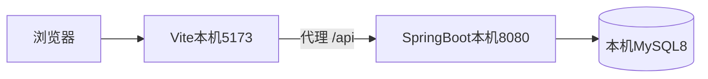
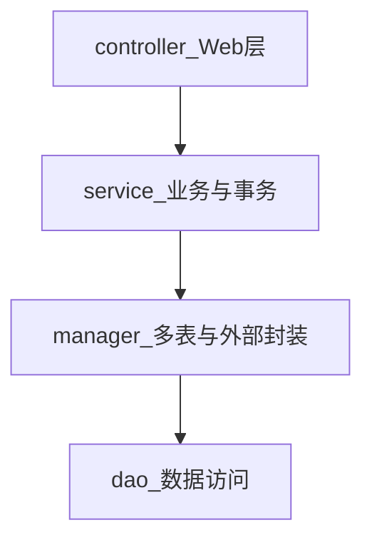
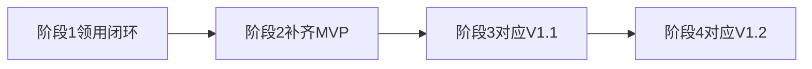
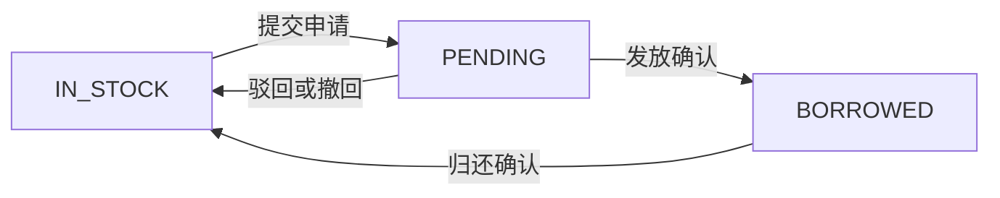
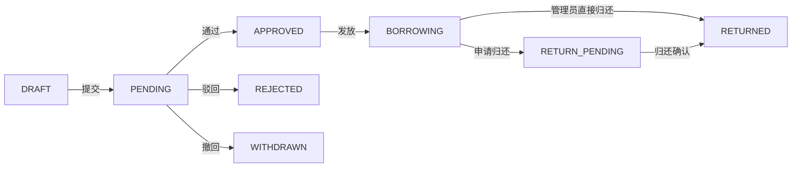

# 资产管理系统技术设计文档

| 项 | 内容 |
| --- | --- |
| 文档名称 | 资产管理系统技术设计文档 |
| 版本 | V1.0 |
| 状态 | 评审稿 |
| 读者 | 开发、测试 |
| 依据 | [产品需求文档](./产品需求文档.md)、[需求分析文档](./需求分析文档.md) |
| 已确认选型 | Vue 3 + Spring Boot 3 + MySQL 8 |

业务规则以产品需求文档为准。本文只规定实现方式、工程切分和第一阶段要跑通的闭环。

## 1. 设计结论

系统做成**一个机构、一套单体、前后端分离**的 Web 应用。规模是 5 万设备、2000 用户，不拆微服务。

| 层次 | 选型 |
| --- | --- |
| 前端 | Vue 3 + TypeScript + Vite + Element Plus + Pinia + Vue Router + ECharts |
| 后端 | Java 17 + Spring Boot 3.4 + Spring Security + JWT |
| 持久化 | MySQL 8.0 + MyBatis-Plus |
| 缓存与锁 | 阶段 1 用进程内内存做登录失败计数。提醒是否已发送靠数据库唯一键。本机跑通不安装 Redis |
| 表格 | EasyExcel |
| 邮件 | Spring Mail，异步发送 |
| 定时任务 | Spring `@Scheduled`，本机单进程执行 |
| 运行方式 | 只在本机跑通。前端 Vite、后端 Spring Boot 各自启动，浏览器访问开发地址。不设计 Nginx、Docker 和生产发布 |

实现上借鉴若依的鉴权方式（JWT、BCrypt、用户与部门表），**不把若依整套脚手架拷进仓库**。本系统只有两种固定角色，领用状态机才是核心，整套菜单权限、代码生成和多租户会把第一阶段拖离业务闭环。

开发按四段进行。第一段只跑通核心流程：管理员入库，职工申请，管理员审批并发放，职工申请归还，管理员确认后设备回到在库，并可再次领用。提醒、图表、导入导出放在第二段，与第一段共用同一套表结构和状态机。

## 2. 技术选型对比

对比对象选的是和本系统最接近的四类产品，不是泛泛的框架清单。

| 项目 | 定位 | 技术栈 | 和本系统的关系 |
| --- | --- | --- | --- |
| [Snipe-IT](https://github.com/grokability/snipe-it) | 国际常用的开源 IT 资产系统，管“谁拿走了哪台笔记本” | Laravel，PHP 8.2+，MySQL / MariaDB / PostgreSQL，Bootstrap + jQuery + Livewire | 领域最接近：资产标签唯一、checkout、预计归还日、操作日志。它的领用是管理员直接 checkout，没有“职工申请 → 审批 → 发放”这条单。不能整包改造成我们的审批流 |
| [GLPI](https://github.com/glpi-project/glpi) | IT 资产 + ITIL 服务台 + CMDB | PHP 8.3+，MySQL 8 / MariaDB，可接资产发现 Agent | 能力远超本需求（工单、许可证、机房、自动盘点）。部署和数据模型都偏重，不适合作为事业单位办公设备领用的底座 |
| [Chemex](https://github.com/celaraze/chemex) | 面向中小团队的 ICT 资产 | Laravel 10，PHP 8.1+，MySQL 5.7+，Dcat Admin，JWT | 中文场景接近，含设备、配件、领用。栈是 PHP 管理后台，和已确认的 Spring Boot 路线不一致。可参考它的“设备 + 领用单”拆分，不采用其框架 |
| [RuoYi-Vue3](https://github.com/yangzongzhuan/RuoYi-Vue3) | 国内机构后台最常见的权限脚手架 | Vue 3 + Vite + Element Plus + Pinia；后端 Spring Boot 2/3/4 分支、Spring Security、JWT、MyBatis、MySQL、Redis | 技术组合与本系统一致，用户、部门、登录锁定、操作日志都有现成实现。它的权限模型是菜单按钮级 RBAC，和“只有管理员 / 普通用户”不匹配。适合借鉴写法，不适合当作业务仓库的起点 |

选型取舍：

| 决策 | 选择 | 理由 |
| --- | --- | --- |
| 后端语言 | Java 17 + Spring Boot 3.4 | 已确认。国内事业单位项目后续接手的人最熟悉这条线。Snipe-IT / Chemex 的 Laravel 领用模型再好，也要改写成 Java 服务，而不是把 PHP 项目嵌进来 |
| 前端 | Vue 3 + Element Plus | 已确认。表格、日期范围、对话框、分页和若依、芋道一类后台同一套组件，图表用 ECharts，不引入第二套 UI |
| 数据库 | MySQL 8.0 | 四类同类项目都能跑在 MySQL 上。本系统无复杂地理或 JSON 检索，不需要为 PostgreSQL 单独维护一套方言 |
| 持久层 | MyBatis-Plus | 列表筛选条件多（类型、状态、两个日期范围、关键字），XML 或 Wrapper 比 JPA Specification 更直观。状态变更仍放在 Service 事务里，不放在自动填充里 |
| 架构形态 | 模块化单体 | 5 万设备、单机构、单级审批。微服务会把领用事务拆到多个进程，状态更容易不一致 |
| 脚手架 | 自建工程，结构对齐若依 | 第一阶段要先看见领用闭环。若依自带的代码生成器、在线定时任务、数据权限注解会掩盖真正的状态机 |
| 缓存 | 进程内内存 | 当前只在本机单进程跑。登录失败计数放内存。阶段 2 的提醒去重用数据库唯一键，不为本机调试再加 Redis |
| 认证 | JWT，无状态 | 前后端分离、用户量 2000。不把会话放进 Tomcat。停用用户时把令牌版本号加一，旧令牌立即失效 |
| 异步 | 进程内线程池 | 邮件发送不进入领用事务。第一阶段甚至可以不接邮件。不引入消息队列 |

明确不采用的方案：

- 不采用 Snipe-IT 的“checkout 即领用”。本系统发放确认之后设备才变为已领用。
- 不采用 GLPI 的 ITIL 工单和自动采集。
- 不把部门做成数据权限角色。部门只是设备和用户上的外键。
- 第一阶段不引入 Elasticsearch、分库分表、对象存储集群。

## 3. 总体架构



本机开发不经过 Nginx。Vite 把 `/api` 代理到 `http://localhost:8080`。Redis 和邮件服务器都不是阶段 1 的启动条件。

后端是一个 Spring Boot 应用，根包 `com.ikrai.project`。包结构遵循《阿里巴巴 Java 开发手册》的应用分层：上层只依赖下层，按层分包，不按业务模块切成互相调用的顶层包。



| 层 | 包 | 职责 |
| --- | --- | --- |
| Web | `controller` | 接 HTTP、校验参数、按角色转发。不写状态机 |
| Service | `service` 与 `service.impl` | 领用审批、发放、归还等业务和事务边界 |
| Manager | `manager` 与 `manager.impl` | 组合多个 DAO；封装邮件发送；登录失败计数 |
| DAO | `dao` | 访问 MySQL，只收发 DO |
| 模型 | `dataobject`、`dto`、`vo`、`query` | 见下方领域模型 |
| 公共 | `common`、`config` | 返回体、异常、枚举、常量、MyBatis 与安全配置 |

业务差异放在类名和层内的下一级包，包名使用单数单词，例如 `controller.asset`、`service.borrow`、`dao`。登录过滤器和 JWT 放在 `config`，不单开业务包。

领域模型按手册命名，禁止使用 `xxxPOJO`：

| 类型 | 后缀 | 放置 | 规则 |
| --- | --- | --- | --- |
| DO | `DO` | `dataobject` | 与表一一对应，如 `AssetDO`、`BorrowOrderDO`、`SysUserDO`。不出 Controller |
| DTO | `DTO` | `dto` | Service、Manager 向外传输，如创建领用单的请求 |
| VO | `VO` | `vo` | Controller 返回给页面，如 `AssetVO`。普通用户的 VO 不含购置价格 |
| Query | `Query` | `query` | 查询条件。超过 2 个参数必须用 Query，禁止用 Map |
| BO | `BO` | `bo` | 仅 Service 内部承载状态迁移判断，不返回给前端 |

阶段 1 不建 AO。列表、详情、审批结果各用自己的 VO。

依赖方向：`BorrowService` 通过 `AssetManager` 修改设备状态，通过 `MessageManager` 写站内信。`AssetService` 不调用 `BorrowService`。设备表上的领用人、领用时间由 `AssetManager` 在领用事务里更新。

Service / DAO 的通用方法用手册前缀：`get` 单条，`list` 多条，`count` 统计，`save` 新增，`update` 修改，`remove` 删除。审批、发放、归还保持业务动词：`approve`、`reject`、`issue`、`confirmReturn`。

## 4. 开发流程与分步实现

功能多，按可演示的业务切片开发，不按“先把所有表建完再写页面”推进。每一段结束时，上一段的接口和页面仍可回归。



### 4.1 阶段 1：跑通核心业务流程

这是第一段必须完成、也是后续所有功能的底座。

参与者：1 名管理员、1 名普通用户、至少 1 台在库设备。

| 步骤 | 系统行为 |
| --- | --- |
| 管理员登录 | 进入管理菜单 |
| 管理员新建设备 | 状态为在库，资产编号唯一 |
| 职工登录并按类型、状态筛选 | 只能看到在库设备和本人相关设备，看不到购置价格 |
| 职工提交领用 | 设备变为审批中，单据为待审批 |
| 管理员驳回或职工撤回 | 设备回到在库。驳回必须有原因 |
| 管理员通过并确认发放 | 设备变为已领用，写入领用人、领用开始时间、预计归还日 |
| 职工申请归还，管理员确认 | 单据已归还，设备回到在库，领用字段清空 |
| 同一设备再次申请 | 可以成功。发放前第二个人申请必须失败 |

阶段 1 同时包含：草稿、登录与改密、两种菜单、设备编辑和受限删除、领用详情时间线。部门、地点、设备类型用单层字典，能在表单里选择即可。

阶段 1 不做：邮件、定时提醒、首页图表、导入导出、用户管理页面之外的完整筛选、续借、维修、报废、盘点、审计查询页，也不做部署。登录失败锁定先用进程内内存计数，本机重启后计数清零即可。

阶段 1 完成的判定：按上表走一遍，中途刷新页面、重复点击提交，设备状态与单据状态始终一致。

### 4.2 阶段 2：补齐 MVP

在阶段 1 的状态机上追加，不改已有状态编码。

- 用户管理：创建、分配两种角色、停用、重置密码、保护最后一名管理员。
- 首页：分角色指标和三张图，指标可下钻到带筛选的列表。
- 导入导出：模板、行级成功失败、按当前筛选导出 xlsx。
- 提醒：到期前 7/3/1 天、到期当天、逾期每日。管理员汇总站内信，领用人站内信加邮件。失败可重试。
- 消息中心：未读、已读、全部已读、顶栏未读数。

阶段 2 结束即 PRD 中的 MVP。维修中、已报废指标允许为 0。

### 4.3 阶段 3：V1.1

续借、调拨、维修、报废、盘点、部门与地点上下级、系统参数页、审计查询与导出、导出字段勾选。续借只更新预计归还日，不新建第二条领用中的单据。

### 4.4 阶段 4：V1.2

设备照片与票据、消息按类型筛选、待办和未读数在操作后立即刷新。

### 4.5 单段内部的开发顺序

每一段内部固定为：

1. 写该段涉及的表和枚举。
2. 写 Service 的状态变更和失败用例（设备已被占用、重复审批、超最长领用天数）。
3. 写接口。
4. 写页面，把接口错误原文展示出来。
5. 用管理员和普通用户各走一遍本段主路径。

先写失败用例，是为了避免页面先做完、状态机事后打补丁。

## 5. 领域模型与状态机

### 5.1 编码

状态在库里存英文编码，界面显示中文。

设备状态 `asset.status`：

| 编码 | 中文 | 阶段 |
| --- | --- | --- |
| `IN_STOCK` | 在库 | 阶段 1 |
| `PENDING` | 审批中 | 阶段 1 |
| `BORROWED` | 已领用 | 阶段 1 |
| `REPAIRING` | 维修中 | 阶段 3 |
| `SCRAPPED` | 已报废 | 阶段 3 |

领用单状态 `borrow_order.status`：

| 编码 | 中文 | 阶段 |
| --- | --- | --- |
| `DRAFT` | 草稿 | 阶段 1 |
| `PENDING` | 待审批 | 阶段 1 |
| `APPROVED` | 已通过，待发放 | 阶段 1 |
| `REJECTED` | 已驳回 | 阶段 1 |
| `WITHDRAWN` | 已撤回 | 阶段 1 |
| `BORROWING` | 领用中 | 阶段 1 |
| `RETURN_PENDING` | 待归还确认 | 阶段 1 |
| `RETURNED` | 已归还 | 阶段 1 |

已逾期不是库里的状态。查询时：`status = BORROWING` 且 `expected_return_date < 今天`，接口额外返回 `overdue = true`。列表用红色展示。归还确认后单据变为 `RETURNED`，逾期标记自然消失。

待归还确认放在单据上，设备保持 `BORROWED`。这样和“确认前设备仍算领出”一致。

### 5.2 状态迁移



单据侧：



合法动作：

| 动作 | 操作者 | 单据前置 | 设备前置 | 结果 |
| --- | --- | --- | --- | --- |
| 保存草稿 | 申请人 | 新建 | `IN_STOCK`，不改设备 | `DRAFT` |
| 提交 | 申请人 | `DRAFT` 或直接提交 | `IN_STOCK` | 单据 `PENDING`，设备 `PENDING` |
| 撤回 | 申请人本人 | `PENDING` | `PENDING` | 单据 `WITHDRAWN`，设备 `IN_STOCK` |
| 通过 | 管理员 | `PENDING` | `PENDING` | 单据 `APPROVED`，设备仍 `PENDING` |
| 驳回 | 管理员 | `PENDING` | `PENDING` | 单据 `REJECTED`，设备 `IN_STOCK`，意见必填 |
| 发放 | 管理员 | `APPROVED` | `PENDING` | 单据 `BORROWING`，设备 `BORROWED`，写入领用人与两个日期 |
| 申请归还 | 领用人本人 | `BORROWING` | `BORROWED` | 单据 `RETURN_PENDING`，设备不变 |
| 归还确认 | 管理员 | `BORROWING` 或 `RETURN_PENDING` | `BORROWED` | 单据 `RETURNED`，设备 `IN_STOCK`，清空领用冗余字段 |

同一事务内更新单据、设备、一条履历。任一步失败全部回滚。

并发控制：更新设备时带 `version`。`UPDATE asset SET status=?, version=version+1 WHERE id=? AND version=? AND status=?`。影响行数为 0 则返回“设备状态已变化，请刷新”。同一设备不会出现两条进行中的单据，因为只有 `IN_STOCK` 才能提交。

进行中单据指：`DRAFT`、`PENDING`、`APPROVED`、`BORROWING`、`RETURN_PENDING`。提交时若该设备已有这类单据，直接拒绝。草稿同一设备也只保留一张，避免占着不提交却挡住别人。草稿不改设备状态；提交时再次检查设备仍为 `IN_STOCK`。

最长领用天数阶段 1 写死 90，放在配置文件。阶段 3 改为系统参数表。预计归还日必须晚于今天，且不超过今天加 90 天。

### 5.3 冗余字段

设备表保存当前领用快照，供列表筛选，避免每条查询都联领用单：

| 设备字段 | 何时写入 | 何时清空 |
| --- | --- | --- |
| `holder_user_id` | 发放确认 | 归还确认 |
| `borrow_start_date` | 发放当天 | 归还确认 |
| `expected_return_date` | 发放时的预计归还日 | 归还确认 |
| `current_borrow_id` | 提交申请时 | 驳回、撤回、归还确认 |

审批中列表要能看到申请人，所以 `current_borrow_id` 在提交时就写上，不只在发放时写。领用时间范围、到期时间范围过滤这两列。两列为空的在库设备不会命中日期条件。

## 6. 数据库设计

字符集 `utf8mb4`，时间用 `DATETIME`，应用时区 `Asia/Shanghai`。主键 `BIGINT` 自增。金额 `DECIMAL(12,2)`。

### 6.1 表清单

| 表 | 阶段 | 说明 |
| --- | --- | --- |
| `sys_user` | 1 | 账号 |
| `sys_dept` | 1 | 部门。阶段 1 只用一层，预留 `parent_id` |
| `sys_location` | 1 | 存放地点。同样预留 `parent_id` |
| `asset_category` | 1 | 设备类型 |
| `asset` | 1 | 设备 |
| `borrow_order` | 1 | 领用单 |
| `borrow_log` | 1 | 审批、发放、归还履历 |
| `site_message` | 2 | 站内信。阶段 1 的通过/驳回可先写这条表，页面放到阶段 2；若阶段 1 要在界面看到结果，详情页展示 `borrow_log` 即可 |
| `mail_record` | 2 | 邮件发送记录 |
| `reminder_mark` | 2 | 提醒去重 |
| `audit_log` | 3 | 审计。阶段 2 的导入导出先记最小日志，正式查询页在阶段 3 |
| `stocktake` / `stocktake_item` | 3 | 盘点 |
| `asset_file` | 4 | 附件 |

阶段 1 就建用户、部门、地点、类型、设备、领用单、履历。后面的表在进入对应阶段时再往仓库根目录 `sql/` 加 `Vn__说明.sql`，避免一次铺开。脚本只放这一处，由 Maven 打进 `classpath:sql`，Flyway 启动时执行。

### 6.2 阶段 1 核心表

`sys_user`

| 字段 | 类型 | 约束 |
| --- | --- | --- |
| id | BIGINT | 主键 |
| username | VARCHAR(64) | 唯一 |
| password_hash | VARCHAR(100) | BCrypt |
| real_name | VARCHAR(64) | 必填 |
| email | VARCHAR(128) | 普通用户必填 |
| mobile | VARCHAR(20) | 可空 |
| dept_id | BIGINT | 可空 |
| role | VARCHAR(16) | `ADMIN` 或 `USER` |
| enabled | TINYINT | 1 启用 |
| token_version | INT | 默认 0，停用或重置密码时加 1 |
| must_change_password | TINYINT | 重置密码后为 1 |
| created_at / updated_at | DATETIME | |

`asset`

| 字段 | 类型 | 约束 |
| --- | --- | --- |
| id | BIGINT | 主键 |
| asset_no | VARCHAR(64) | 唯一，必填 |
| name | VARCHAR(128) | 必填 |
| category_id | BIGINT | 必填 |
| brand / model | VARCHAR(64) | 可空 |
| serial_no | VARCHAR(64) | 可空，唯一 |
| status | VARCHAR(16) | 见 5.1 |
| purchase_date | DATE | 可空 |
| purchase_price | DECIMAL(12,2) | 可空，接口对普通用户脱敏 |
| supplier | VARCHAR(128) | 可空 |
| warranty_until | DATE | 可空 |
| dept_id / location_id | BIGINT | 可空 |
| holder_user_id | BIGINT | 可空 |
| borrow_start_date | DATE | 可空 |
| expected_return_date | DATE | 可空 |
| current_borrow_id | BIGINT | 可空 |
| remark | VARCHAR(500) | 可空 |
| version | INT | 乐观锁，默认 0 |
| created_at / updated_at | DATETIME | |

`serial_no` 的唯一索引允许多个 NULL，MySQL 唯一索引对 NULL 不冲突，符合“不填则不校验”的规则。

`borrow_order`

| 字段 | 类型 | 约束 |
| --- | --- | --- |
| id | BIGINT | 主键 |
| order_no | VARCHAR(32) | 唯一。`LY` + `yyyyMMdd` + 4 位序号 |
| asset_id | BIGINT | 必填 |
| applicant_id | BIGINT | 必填 |
| purpose | VARCHAR(500) | 提交时必填 |
| expected_return_date | DATE | 提交时必填 |
| remark | VARCHAR(500) | 可空 |
| status | VARCHAR(20) | 见 5.1 |
| approver_id | BIGINT | 可空 |
| approved_at | DATETIME | 可空 |
| approve_comment | VARCHAR(500) | 驳回必填 |
| issued_at | DATETIME | 发放时间，即领用开始 |
| return_requested_at | DATETIME | 可空 |
| returned_at | DATETIME | 可空 |
| return_comment | VARCHAR(500) | 可空 |
| version | INT | 乐观锁 |
| created_at / updated_at | DATETIME | |

`borrow_log`

| 字段 | 类型 | 说明 |
| --- | --- | --- |
| id | BIGINT | 主键 |
| borrow_id | BIGINT | |
| action | VARCHAR(32) | `SUBMIT` `WITHDRAW` `APPROVE` `REJECT` `ISSUE` `REQUEST_RETURN` `CONFIRM_RETURN` |
| operator_id | BIGINT | |
| comment | VARCHAR(500) | |
| created_at | DATETIME | |

### 6.3 索引

| 索引 | 用途 |
| --- | --- |
| `asset(status, category_id)` | 类型 + 状态筛选 |
| `asset(holder_user_id)` | 管理员按领用人筛选 |
| `asset(dept_id)` `asset(location_id)` | 部门、地点 |
| `asset(expected_return_date)` | 到期范围、逾期扫描 |
| `asset(borrow_start_date)` | 领用时间范围 |
| `borrow_order(asset_id, status)` | 进行中单据检查 |
| `borrow_order(applicant_id, status)` | 我的申请 |
| `borrow_order(status, expected_return_date)` | 提醒扫描 |

关键字用 `asset_no`、`name`、`serial_no` 的前缀或包含查询。5 万行以内，`name` 使用 `LIKE` 可接受。编号用左匹配优先。

### 6.4 列表数据范围

管理员：按筛选条件查 `asset`，返回含价格的视图。

普通用户：`status = IN_STOCK`，或者 `current_borrow_id` 对应单据的 `applicant_id` 为本人。SQL 用 `OR` 包在数据范围里，再与其他筛选做并且。接口组装 VO 时不输出 `purchasePrice`、`supplier`。导出接口只对 `ADMIN` 开放，不靠前端藏按钮。

逾期展示：`status = BORROWED AND expected_return_date < CURDATE()`。筛选“已逾期”时用这个条件，不把逾期写进 `status` 列。

## 7. 接口设计

前缀 `/api`。除登录外都带 `Authorization: Bearer <token>`。

统一返回：

```json
{ "code": 0, "message": "ok", "data": {} }
```

`code = 0` 成功。参数错误 HTTP 400，未登录 401，无权限 403，状态冲突 409。正文 `message` 用中文，前端直接展示。分页：

```json
{ "list": [], "total": 0, "page": 1, "pageSize": 20 }
```

### 7.1 阶段 1 接口

| 方法 | 路径 | 角色 | 说明 |
| --- | --- | --- | --- |
| POST | `/api/auth/login` | 匿名 | 账号、密码。返回 token、角色、是否必须改密 |
| POST | `/api/auth/logout` | 已登录 | 前端丢弃 token。服务端无状态 |
| GET | `/api/auth/me` | 已登录 | 当前用户，不含密码 |
| PUT | `/api/auth/password` | 已登录 | 原密码、新密码 |
| GET | `/api/categories` | 已登录 | 启用中的设备类型 |
| GET | `/api/depts` | 已登录 | 启用中的部门 |
| GET | `/api/locations` | 已登录 | 启用中的地点 |
| GET | `/api/assets` | 已登录 | 筛选见下 |
| POST | `/api/assets` | ADMIN | 新建，状态固定 `IN_STOCK` |
| GET | `/api/assets/{id}` | 已登录 | 详情 + 领用履历。普通用户受数据范围限制 |
| PUT | `/api/assets/{id}` | ADMIN | 不允许手改 status、领用人、日期 |
| DELETE | `/api/assets/{id}` | ADMIN | 仅 `IN_STOCK` 且没有任何领用单 |
| POST | `/api/borrows` | 已登录 | 创建。`submit=true` 则直接提交，否则草稿 |
| POST | `/api/borrows/{id}/submit` | 申请人 | 草稿转待审批 |
| POST | `/api/borrows/{id}/withdraw` | 申请人 | 撤回 |
| POST | `/api/borrows/{id}/approve` | ADMIN | 通过 |
| POST | `/api/borrows/{id}/reject` | ADMIN | 驳回，`comment` 必填 |
| POST | `/api/borrows/{id}/issue` | ADMIN | 发放 |
| POST | `/api/borrows/{id}/return-request` | 申请人 | 申请归还 |
| POST | `/api/borrows/{id}/return-confirm` | ADMIN | 归还确认，`comment` 可选 |
| GET | `/api/borrows` | 已登录 | 我的单据；管理员可查全部 |
| GET | `/api/borrows/todos` | ADMIN | 待审批、待发放、待归还三个列表 |
| GET | `/api/borrows/{id}` | 单据相关人 | 管理员或申请人 |

`GET /api/assets` 查询参数：

| 参数 | 说明 |
| --- | --- |
| `categoryIds` | 多选，或关系 |
| `statuses` | 多选。传 `OVERDUE` 时按逾期条件过滤，不查 status 列 |
| `borrowStartFrom` `borrowStartTo` | 领用日期，含边界 |
| `dueFrom` `dueTo` | 预计归还日，含边界 |
| `keyword` | 编号、名称、序列号 |
| `holderUserId` | 仅管理员有效，普通用户传入被忽略 |
| `deptId` `locationId` | |
| `page` `pageSize` | 默认 1、20，最大 100 |

日期开始晚于结束时 400。

### 7.2 阶段 2 接口

| 方法 | 路径 | 角色 | 说明 |
| --- | --- | --- | --- |
| GET POST PUT | `/api/users` | ADMIN | 用户管理。禁止停用自己和最后一名管理员 |
| GET | `/api/stats/overview` | 已登录 | 按角色返回指标 |
| GET | `/api/stats/by-category` | 已登录 | 类型分布 |
| GET | `/api/stats/borrow-trend` | 已登录 | 近 6 个月，按发放月计数 |
| GET | `/api/messages` | 已登录 | 只返回自己的消息 |
| POST | `/api/messages/read` | 已登录 | 单条或全部已读 |
| GET | `/api/messages/unread-count` | 已登录 | 顶栏数字 |
| GET | `/api/assets/import-template` | ADMIN | 下载 xlsx 模板 |
| POST | `/api/assets/import` | ADMIN | multipart 上传 |
| GET | `/api/assets/export` | ADMIN | 查询参数与列表相同，忽略分页 |
| GET | `/api/mail-records` | ADMIN | 发送记录 |
| POST | `/api/mail-records/{id}/retry` | ADMIN | 重试失败邮件 |

统计口径与列表一致。管理员计数全表；普通用户只计本人单据和本人在用设备。趋势图统计 `borrow_order.issued_at` 落在该月、且曾经发放的单据，驳回单不计入。

## 8. 权限与安全

角色只有 `ADMIN`、`USER`。用 Spring Security 的方法注解区分接口，例如发放接口标注管理员。数据范围在查询层追加，不做成可配置权限点。

登录：

- 密码 BCrypt。失败统一“账号或密码错误”。
- 连续失败 5 次，在内存中锁定 15 分钟。后端重启后计数清零。
- 停用用户直接拒绝。
- JWT 载荷含 `userId`、`role`、`tokenVersion`。过滤器比对数据库中的 `token_version`，不一致则 401。停用和重置密码都会增加版本。
- 访问令牌有效期 8 小时。单机构内网，阶段 1 不做刷新令牌。过期后重新登录。

普通用户详情接口如果设备既不是在库、也不是本人单据，返回 404，避免用编号探测他人资产。

日志不打印密码、令牌和完整邮箱正文。

## 9. 提醒、导入与统计设计

这些属于阶段 2，表结构和任务在这里定死，阶段 1 不实现任务本身。

### 9.1 每日提醒

每天 08:00 执行，cron `0 0 8 * * ?`。本机只跑一个后端进程，不另加分布式锁。

扫描 `borrow_order.status = BORROWING`：

| 条件 | 类型编码 | 接收人 |
| --- | --- | --- |
| 预计归还日减今天 = 7、3 或 1 | `DUE_SOON` | 领用人一封；全部管理员合并一封 |
| 预计归还日 = 今天 | `DUE_TODAY` | 同上 |
| 预计归还日早于今天 | `OVERDUE` | 同上，逾期后每天一次 |

去重表 `reminder_mark(biz_date, remind_type, borrow_id, receiver_id)` 唯一。管理员汇总使用 `borrow_id = 0` 的一行代表“当日该类型汇总已生成”。插入成功才发信。先插入站内信，再写 `mail_record`。邮件用 `@Async` 发送。失败把记录标为 `FAILED` 并保存原因，站内信保留。SMTP 未配置时记录 `SKIPPED`，原因写“邮件通道未配置”。

领用人邮件只含本人设备。管理员不发逐台邮件。

### 9.2 导入导出

EasyExcel。模板表头与中文列名固定：资产编号、资产名称、设备类型、品牌、型号、序列号、购置日期、购置价格、供应商、保修截止日期、责任部门、存放地点、备注。第一行表头，第二行示例，导入时跳过示例（约定示例资产编号为 `EXAMPLE`）。

单次最多 2000 行。逐行校验：必填、类型/部门/地点名称能匹配到启用数据、编号和序列号在文件内及库内不重复、日期和金额格式。合法行批量插入，状态 `IN_STOCK`。失败行收集行号和原因，接口一并返回，并生成可下载的失败文件。

导出复用列表查询，去掉分页，上限 10000。超出返回 400，提示缩小筛选。文件名 `设备台账-yyyyMMddHHmmss.xlsx`。

### 9.3 首页统计 SQL 要点

指标用条件计数，一次查询分组完成状态分布。即将到期：`BORROWED` 且预计归还日在今天到今天加 7 天之间。已逾期：`BORROWED` 且预计归还日早于今天。待审批：领用单 `PENDING` 的数量。类型分布对设备按 `category_id` 分组。普通用户的类型分布只统计本人 `BORROWING` 的设备。

## 10. 前端方案

前端不从零搭工程。使用 Vue 官网的官方脚手架 [create-vue](https://vuejs.org/guide/quick-start.html)，在空目录执行：

```bash
npm create vue@latest
```

该命令由 Vite 提供工程壳，交互项里开启 TypeScript、Vue Router、Pinia。JSX、端到端测试在阶段 1 不启用。生成结果放进仓库的 `frontend/`。`vite.config`、`tsconfig`、`src/main.ts`、路由和 Pinia 的初始文件沿用脚手架，只在上面追加业务页面。

Node.js 按 Vue 官网 Quick Start 的当前要求：22.18.0 及以上，或 24.12.0 及以上。

Element Plus、ECharts、Axios 在壳子生成后按各自当前文档接入，不改用另一套后台模板。Element Plus 官方的 Vite Starter 带了 ViteSSG、文件路由和 UnoCSS，和本系统已选的 Vue Router、Pinia 重复，不作为起点。

写页面、改路由或接组件之前，用 Context7 查最新用法，不以记忆中的 API 为准。先解析库 ID，再按本次要用的一个主题查询。常用库：

| 库 | Context7 库 ID | 查询时机 |
| --- | --- | --- |
| Vue | `/websites/vuejs` | 脚手架命令、单文件组件、组合式 API |
| Vue Router | `/vuejs/vue-router` | 路由守卫、元信息 |
| Pinia | 解析 `Pinia` 后使用返回的官方库 ID | 登录态 |
| Element Plus | `/element-plus/element-plus` | 表格、表单、日期范围、消息提示 |

目录在脚手架默认结构上增加业务目录：

```text
frontend/                 # npm create vue@latest 生成
  src/api/                # 按模块封装请求
  src/stores/auth.ts      # 脚手架已含 stores，这里只加登录态
  src/router/             # 脚手架已含 router，补路由元信息 role
  src/layouts/            # 侧栏 + 顶栏
  src/views/login/
  src/views/asset/
  src/views/borrow/
  src/views/dashboard/    # 阶段 2
  src/views/message/      # 阶段 2
  src/views/system/       # 阶段 2 用户管理
```

路由守卫读取登录态。`meta.role = ADMIN` 的页面，普通用户访问时进入无权限页。菜单按角色写死两份，不请求菜单树。

阶段 1 页面：登录、设备列表、设备表单、设备详情、申请领用、我的领用、领用办理、领用详情、个人改密。

筛选条件同步到 URL 查询参数，从详情返回时保留。提交按钮在请求期间禁用。409 和 400 的 `message` 用 ElMessage 展示。

状态标签颜色按产品需求文档：在库绿、审批中蓝、已领用橙、逾期红。

Axios 响应拦截器：401 清 token 并跳转登录。

## 11. 工程结构与本地运行

仓库按手册的分层方式组织后端，Maven 单模块，根包 `com.ikrai.project`。

```text
AssetManagementSys/
  docs/
  sql/                       # 初始化与迁移脚本唯一存放处，Flyway 按 Vn__ 顺序执行
  frontend/
  backend/
    pom.xml
    src/main/java/com/ikrai/project/
      ProjectApplication.java
      controller/
        asset/                 # AssetController
        borrow/                # BorrowController
        user/                  # 登录与个人中心，阶段 2 增加用户管理
      service/
        asset/
          AssetService.java
          impl/AssetServiceImpl.java
        borrow/
          BorrowService.java
          impl/BorrowServiceImpl.java
      manager/
        asset/
          AssetManager.java
          impl/AssetManagerImpl.java
        borrow/
          BorrowManager.java
          impl/BorrowManagerImpl.java
      dao/                     # AssetDao、BorrowOrderDao、BorrowLogDao
      dataobject/              # AssetDO、BorrowOrderDO、SysUserDO
      dto/
      vo/
      query/                   # AssetQuery
      bo/
      common/
        constant/
        enums/
        exception/
        result/                # 统一返回体
      config/                  # 安全、MyBatis、跨域、JWT
    src/main/resources/
      application-dev.yml      # flyway.locations = classpath:sql，脚本由根目录 sql/ 打包进来
    src/test/java/com/ikrai/project/
```

包名全小写，点号之间一个英文单词，使用单数。`enum` 是 Java 关键字，枚举包使用 `enums`。DAO 接口放在 `dao`，可以用 MyBatis 的 `@Mapper`，类名以 `Dao` 结尾，不使用 `mapper` 包。测试包与主包同名，放在 `src/test/java`。

当前只保留开发配置 `application-dev.yml`，连接本机 MySQL。数据库账号、JWT 密钥写在该文件中，供本机调试。不增加生产配置，不增加 Docker 和 Nginx。

本机依赖：JDK 17、Maven、Node.js 22.18.0 及以上（或 24.12.0 及以上）、MySQL 8。不要求安装 Redis。前端用 `npm create vue@latest` 生成，不手写 Vite 工程。

启动顺序：

1. 本机 MySQL 建好空库，例如 `ams`。
2. 启动后端，Flyway 建表，写入管理员 `admin` 和七个设备类型。初始密码打印在启动日志里，首次登录后强制修改。
3. 若 `frontend/` 尚未生成，在该目录执行 `npm create vue@latest`，开启 TypeScript、Vue Router、Pinia。然后 `npm run dev`。浏览器打开 Vite 地址，接口经代理访问 `localhost:8080`。

## 12. 关键事务伪代码

发放确认代表所有状态变更的写法：

```text
开启事务
  按 id 查询领用单，校验 status = APPROVED，版本匹配
  按 asset_id 查询设备，校验 status = PENDING，版本匹配
  更新领用单为 BORROWING，写入 issued_at、approver 已在通过时写过
  更新设备为 BORROWED，写入 holder、borrow_start_date、expected_return_date
  两条更新的 WHERE 都带 version 和原状态
  任一影响行数为 0 则抛冲突异常，事务回滚
  插入 borrow_log(ISSUE)
提交事务
```

通过审批只改单据为 `APPROVED`，设备保持 `PENDING`。这段差异要在代码注释和测试里各写一条，避免发放前设备被标成已领用。

## 13. 阶段 1 测试要点

| 用例 | 期望 |
| --- | --- |
| 重复资产编号、重复序列号 | 保存失败并指出字段 |
| 非在库设备申请 | 失败，提示当前状态 |
| 预计归还日超过 90 天 | 失败 |
| 两人同时申请同一在库设备 | 只有一个成功，另一个 409 |
| 驳回不填原因 | 失败 |
| 发放前设备状态 | 仍为审批中 |
| 发放后普通用户再查价格字段 | 响应中无该字段 |
| 普通用户打开他人领用中的设备 | 404 |
| 归还确认后再次申请 | 成功 |
| 重复点击发放 | 第二次 409 |
| 停用用户使用旧 token | 401 |

阶段 1 用 Spring Boot 测试切片覆盖状态机，页面用两种账号手工走通主路径。自动化浏览器留到阶段 2 首页和导入稳定之后。

## 14. 风险与后续确认

| 项 | 处理 |
| --- | --- |
| 机构 SMTP 地址尚未提供 | 阶段 1 不发邮件。阶段 2 再在本机配置里接入；未配置时只发站内信 |
| 本机 MySQL | 使用本机已安装的 MySQL 8，建空库后由 Flyway 建表。没有 Redis 也能跑阶段 1 |
| 初始管理员密码 | 首次启动把随机密码打在后端日志里，登录后立即修改 |
| 历史 Excel 列名与模板不一致 | 阶段 2 提供标准模板。旧表由管理员整理后再导，系统不做模糊列名猜测 |

下一实现步骤只做第 4.1 节的阶段 1。阶段 1 跑通之前，不开始图表、导入导出和定时邮件。
