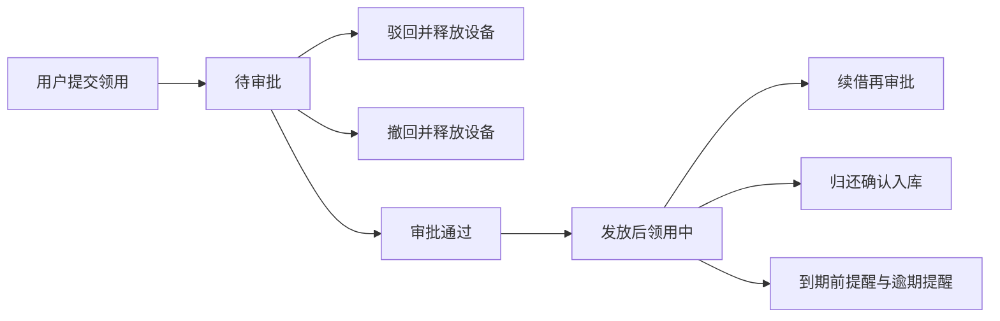

# 资产管理系统需求分析文档

| 项 | 内容 |
| --- | --- |
| 文档名称 | 资产管理系统需求分析文档 |
| 版本 | V1.0 |
| 状态 | 评审稿 |
| 读者 | 产品、设计、开发、测试、业务管理员 |

## 1. 文档说明

### 1.1 目的

本文档描述研究机构、事业单位 IT 办公设备资产管理系统的业务范围、角色权限、数据对象、业务流程与功能需求，作为后续设计、开发与验收的依据。

### 1.2 范围

系统管理笔记本、台式机、显示器、鼠标、键盘、转接头、投影仪等 IT 办公设备，并允许扩展其他设备类型。覆盖设备台账、领用申请与审批、到期与逾期提醒、检索过滤、首页统计、导入导出、用户与角色，以及管理员视图和普通用户视图。

本文档只定义需求，不规定具体技术选型与接口实现。

### 1.3 术语

| 术语 | 含义 |
| --- | --- |
| 资产 / 设备 | 纳入台账管理的一件 IT 办公设备，以资产编号唯一标识 |
| 在库 | 设备可被申请领用，当前无人占用 |
| 领用 | 普通用户经审批后在约定期限内使用设备 |
| 到期 | 到达领用单约定的预计归还日 |
| 逾期 | 超过预计归还日仍未完成归还确认 |
| 站内信 | 登录系统后可在消息中心查看的通知 |
| 发放 | 审批通过后，管理员确认设备已交给领用人，领用正式生效 |
| 归还确认 | 管理员确认设备已收回并检验，设备回到在库 |

## 2. 背景与目标

### 2.1 背景

研究机构的 IT 办公设备数量多、流转频繁，常见问题是：

- 台账分散在表格中，资产编号、存放地点、责任人容易不一致。
- 领用靠口头或即时通讯，没有审批留痕，设备去向难以追溯。
- 领用到期后无人提醒，设备长期滞留在个人手中。
- 按类型、状态、领用时间、到期时间筛选和汇总依赖手工，统计滞后。
- 批量入库与对外报送缺少统一的导入导出能力。
- 管理员与普通职工看到同一套数据和操作，权限边界不清晰。

### 2.2 建设目标

- 建立统一设备台账，记录类型、状态、领用与到期信息。
- 领用必须经过申请和审批，过程可追溯。
- 到期前、到期当天和逾期后自动提醒：管理员收站内信，领用用户收站内信和邮件。
- 支持按设备类型、状态、领用时间范围、到期时间范围等条件过滤。
- 首页用图表展示数据概览，并按角色区分数据范围。
- 支持设备信息导入与导出。
- 提供用户管理与角色管理，角色分为系统管理员和普通用户，界面与数据范围随角色切换。

### 2.3 用户与使用场景

| 用户 | 典型场景 |
| --- | --- |
| 系统管理员 | 维护台账、审批领用、确认发放与归还、查看全机构统计、处理即将到期和逾期、导入导出、管理用户 |
| 普通用户 | 查看可领用设备、提交领用申请、查看本人申请与在用设备、申请归还或续借、接收到期提醒 |

## 3. 角色与权限

系统只设两种业务角色，不增设部门管理员或其他角色。部门、课题组仅作为设备与用户的归属数据，不单独授权。

### 3.1 角色定义

| 角色 | 说明 |
| --- | --- |
| 系统管理员 | 管理全部设备、审批与发放、用户与角色、组织与地点、系统参数、导入导出和全机构统计。接收全机构即将到期与逾期的站内信汇总 |
| 普通用户 | 浏览在库设备，提交本人领用、归还、续借申请，查看本人单据与消息。接收本人设备的站内信和邮件 |

一名用户只绑定一个角色。管理员账号由初始化或既有管理员创建。系统至少保留一名可用的系统管理员，不允许删除或停用最后一名管理员。

### 3.2 权限矩阵

| 能力 | 系统管理员 | 普通用户 |
| --- | --- | --- |
| 登录、修改本人密码、个人中心 | 是 | 是 |
| 首页统计 | 全机构 | 仅本人 |
| 设备列表 | 全部设备，含价格等管理字段 | 在库设备及本人相关设备，不展示购置价格 |
| 新建设备、编辑、删除、报废、维修、调拨、盘点 | 是 | 否 |
| 提交领用申请、撤回待审批申请 | 可为本人提交 | 是 |
| 审批通过、驳回 | 是 | 否 |
| 发放确认、归还确认 | 是 | 否 |
| 申请归还、申请续借 | 是 | 仅本人单据 |
| 导入、下载导入模板、导出 | 是 | 否 |
| 用户管理、角色分配、停用启用 | 是 | 否 |
| 部门与存放地点维护 | 是 | 否 |
| 系统参数、审计日志、邮件发送记录 | 是 | 否 |
| 消息中心 | 全机构汇总类通知及本人通知 | 仅本人通知 |

未授权操作在界面中不展示入口。若通过地址直接访问，系统拒绝并提示无权限。

## 4. 业务对象

### 4.1 设备

| 字段 | 规则 |
| --- | --- |
| 资产编号 | 必填，全局唯一 |
| 资产名称 | 必填 |
| 设备类型 | 必填，来自设备类型字典 |
| 品牌、型号 | 选填 |
| 序列号 | 选填；若填写则全局唯一 |
| 设备状态 | 在库、审批中、已领用、维修中、已报废 |
| 购置日期、购置价格、供应商 | 选填；价格仅管理员可见 |
| 保修截止日期 | 选填 |
| 责任部门 | 选填，来自部门字典 |
| 存放地点 | 选填，来自地点字典 |
| 当前领用人、领用开始时间、预计归还时间 | 已领用或审批中时由领用单回写；在库时为空 |
| 备注、附件 | 选填。附件用于照片、发票、验收单 |

初始设备类型：笔记本、台式机、显示器、鼠标、键盘、转接头、投影仪。管理员可增删改类型；已被设备引用的类型不可删除，只可停用。

### 4.2 设备状态

| 状态 | 含义 | 可否被新申请 |
| --- | --- | --- |
| 在库 | 可领用 | 是 |
| 审批中 | 已有一条进行中的领用申请，设备被占用 | 否 |
| 已领用 | 已发放给领用人 | 否 |
| 维修中 | 维修，不可领用 | 否 |
| 已报废 | 退出使用 | 否 |

状态迁移：

- 提交领用申请：在库 → 审批中。
- 驳回或撤回：审批中 → 在库。
- 审批通过并发放确认：审批中 → 已领用。
- 归还确认：已领用 → 在库。
- 管理员登记维修：在库 → 维修中；维修完成：维修中 → 在库。已领用设备需先归还再维修。
- 管理员报废：在库或维修中 → 已报废。已报废不可再领用、不可删除历史。

### 4.3 领用单

| 字段 | 规则 |
| --- | --- |
| 单号 | 系统生成，唯一 |
| 申请人 | 当前登录用户 |
| 设备 | 必填，且申请时状态为在库 |
| 用途 | 必填 |
| 预计归还日 | 必填，晚于申请日，且不超过系统参数中的单次最长领用天数 |
| 领用说明 | 选填 |
| 状态 | 草稿、待审批、已通过、已驳回、已撤回、领用中、已归还、已逾期 |
| 审批人、审批时间、审批意见 | 审批后填写。驳回时意见必填 |
| 发放时间 | 发放确认时填写，作为领用开始时间 |
| 实际归还时间 | 归还确认时填写 |

同一设备同一时间只允许一条进行中的申请。进行中指状态为草稿、待审批、已通过（待发放）或领用中。

领用单状态说明：

| 状态 | 含义 |
| --- | --- |
| 草稿 | 已保存未提交，不占用设备 |
| 待审批 | 已提交，设备为审批中 |
| 已通过 | 审批同意，等待发放确认，设备仍为审批中 |
| 已驳回 | 审批拒绝，设备回到在库 |
| 已撤回 | 申请人在待审批时撤回，设备回到在库 |
| 领用中 | 已发放，设备为已领用。到达预计归还日次日仍未归还时，展示为已逾期，设备状态保持已领用 |
| 已归还 | 管理员已确认收回 |
| 已逾期 | 领用中且当前日期晚于预计归还日。归还确认后变为已归还 |

已逾期是领用中的派生状态，用于列表、提醒和统计，不单独占用设备。

### 4.4 续借与归还

- 归还申请：领用人对“领用中 / 已逾期”单据发起归还。单据进入待归还确认，设备保持已领用，直到管理员归还确认。
- 续借：领用人填写新的预计归还日和理由，生成续借审批。续借通过后更新原单预计归还日，并重新计算提醒；驳回则维持原到期日。续借期间设备保持已领用。同一单据存在未完成续借审批时，不可再次发起续借。

### 4.5 用户、部门与地点

| 对象 | 关键字段 |
| --- | --- |
| 用户 | 账号、姓名、邮箱、手机、所属部门、角色、启用状态。邮箱用于到期邮件，普通用户邮箱必填 |
| 部门 | 名称、上级部门、启用状态。可表示处室、课题组、实验室 |
| 存放地点 | 名称、上级地点、启用状态。可表示楼栋、房间 |

### 4.6 消息与邮件

| 对象 | 说明 |
| --- | --- |
| 站内信 | 接收人、标题、正文、类型、关联单据、已读状态、创建时间 |
| 邮件发送记录 | 接收人、邮箱、主题、正文、关联单据、发送状态、失败原因、重试次数、发送时间 |

消息类型包括：待审批、审批结果、发放、归还确认、续借结果、到期提醒、逾期提醒、导入结果。

### 4.7 审计日志

记录操作者、时间、模块、动作、对象编号、变更摘要。覆盖设备新增与修改、状态变更、审批、发放、归还、导入导出、用户与角色变更、系统参数变更。日志只追加，不可改删。

## 5. 核心流程

### 5.1 领用审批与发放

步骤：

1. 普通用户从在库设备发起领用，填写用途和预计归还日，提交后生成待审批领用单，设备变为审批中。
2. 管理员在待办中通过或驳回。驳回必须填写原因，设备回到在库，申请人收到站内信。
3. 申请人可在待审批时撤回，效果与驳回相同，原因为“申请人撤回”。
4. 审批通过后，管理员执行发放确认。确认后领用单变为领用中，设备变为已领用，记录领用人、领用开始时间和预计归还时间。申请人收到站内信。
5. 未发放前设备不可被他人申请。

异常：

- 设备不是在库：禁止提交，提示当前状态。
- 预计归还日超出最长领用天数：禁止提交。
- 审批时设备或单据状态已变化：禁止重复审批，提示刷新。

### 5.2 归还确认

1. 领用人对本人领用中或已逾期的单据提交归还申请。
2. 管理员核对设备后执行归还确认，可填写外观与附件情况。
3. 确认后领用单变为已归还，设备回到在库，清空当前领用人与领用时间，申请人收到站内信。

管理员也可对领用中单据直接登记归还确认，无需等待用户先申请。适用于人已离职或设备已收回的情况。

### 5.3 续借

1. 领用人在领用中发起续借，填写新预计归还日和理由。新日期必须晚于原预计归还日，且自原发放日起的总时长不超过允许的续借上限（见系统参数）。
2. 管理员审批。通过后更新预计归还日；若此前已逾期且新日期晚于今天，逾期标记清除。驳回则保持原日期。
3. 双方收到站内信。

### 5.4 到期与逾期提醒

系统按日扫描领用中的单据。

| 时点 | 管理员 | 普通领用用户 |
| --- | --- | --- |
| 到期前 7 天、3 天、1 天（可配置） | 站内信汇总：即将到期清单 | 站内信 + 邮件，仅本人设备 |
| 到期当天 | 站内信汇总 | 站内信 + 邮件 |
| 逾期后每个自然日 | 站内信汇总：已逾期清单 | 站内信 + 邮件 |

规则：

- 同一单据、同一时点、同一接收人每天至多发送一次，避免重复打扰。
- 管理员通知按接收管理员汇总，不按设备拆成多封，正文列出资产编号、名称、领用人、预计归还日、逾期天数。
- 用户通知只包含本人名下设备。
- 先写站内信，再发送邮件。邮件失败不影响站内信，记入发送记录，管理员可手动重试。
- 停用邮件通道时，用户仍收到站内信，邮件记录标记为未发送并注明原因。
- 用户邮箱为空时跳过邮件并记录原因，站内信照常发送。

## 6. 功能需求

优先级：P0 为上线必须，P1 为重要增强，P2 为加分能力。

### 6.1 登录与个人中心（P0）

**输入：** 账号、密码。

**规则：**

- 账号密码正确且用户为启用状态方可登录。
- 连续失败达到阈值后临时锁定，避免暴力尝试。
- 登录后按角色进入对应首页。
- 用户可修改本人密码，需校验原密码。
- 个人中心展示姓名、部门、邮箱、角色，普通用户可维护本人邮箱与手机。

**输出：** 登录成功进入首页；失败提示账号或密码错误，不暴露账号是否存在。

**异常：** 停用用户不可登录；邮箱格式不合法不可保存。

### 6.2 设备台账（P0）

**管理员输入：** 第 4.1 节字段。支持新增、编辑、查看详情。

**规则：**

- 资产编号必填且唯一，序列号填写时唯一。
- 删除仅允许从未被领用单引用、且状态为在库的设备。已有业务记录的设备用报废代替删除。
- 详情展示当前状态、领用信息、历史领用记录和状态变更记录。
- 列表默认按更新时间倒序，支持分页。

**输出：** 设备保存成功并出现在列表中。编号或序列号重复时指出冲突字段。

### 6.3 设备列表与过滤（P0）

**输入：**

- 设备类型（可多选）
- 设备状态（可多选）
- 领用时间范围（开始日、结束日，含边界）
- 到期时间范围（预计归还日的开始日、结束日，含边界）
- 关键字：资产名称、资产编号、序列号
- 领用人
- 存放地点
- 责任部门

**规则：**

- 条件之间为“并且”关系。同一条件多选为“或者”关系。
- 领用时间、到期时间只命中存在对应日期的设备。未领用设备不会出现在填写了这两个范围的结果中。
- 日期范围开始日不得晚于结束日。
- 普通用户默认看到在库设备，以及本人申请中、领用中的设备。不提供领用人筛选，不展示购置价格。
- 筛选条件可清空并恢复默认列表。筛选结果与导出使用同一套条件。

**输出：** 分页列表。列至少包括资产编号、名称、类型、状态、存放地点、领用人、领用时间、预计归还日。已逾期行需明显标识。

### 6.4 领用申请与审批（P0）

**输入：** 设备、用途、预计归还日、领用说明。审批时为通过或驳回及意见。

**规则：**

- 仅在库设备可申请。
- 提交后进入待审批并占用设备；草稿不占用。
- 申请人可撤回待审批单据。
- 管理员对待审批单据执行通过或驳回，驳回意见必填。
- 审批通过后须发放确认才变为领用中。
- 我的申请列出本人全部单据及状态。
- 管理员待办列出待审批、待发放、待归还确认。

**输出：** 单据状态按第 5 节变化，相关人收到站内信。

**异常：** 重复提交、设备已被占用、超期天数不合法、单据状态不允许当前操作时，操作失败并说明原因。

### 6.5 归还与续借（P1）

**输入：** 归还申请无需额外必填项。续借需新预计归还日和理由。归还确认可填写验收说明。

**规则：** 见第 5.2、5.3 节。普通用户只能操作本人单据。

**输出：** 归还确认后设备在库；续借通过后到期日更新，后续提醒按新日期计算。

### 6.6 消息通知与到期提醒（P0）

**输入：** 系统定时任务按第 5.4 节产生提醒。业务动作产生审批、发放、归还类站内信。

**规则：**

- 消息中心支持未读、已读筛选，打开后标记已读，支持全部已读。
- 导航展示未读数量。
- 管理员查看即将到期与逾期的汇总消息。
- 普通用户查看本人消息。
- 管理员可查看邮件发送记录并重试失败记录。

**输出：** 对应角色在消息中心看到通知；用户邮箱收到到期或逾期邮件。

**异常：** 邮件失败保留站内信与失败原因；任务漏跑后下次扫描补发当日应发提醒，不补发更早日期的重复提醒。

### 6.7 首页统计（P0）

**管理员首页：**

- 指标卡：设备总数、在库、已领用、审批中、维修中、已报废、即将到期（7 天内）、已逾期、待审批数量。
- 图表：设备状态占比、设备类型分布、近 6 个月领用次数趋势。
- 列表入口：待办、即将到期、已逾期。

**普通用户首页：**

- 指标卡：我的申请中、我的在用、我的即将到期、我的已逾期。
- 图表：本人在用设备的类型分布、近 6 个月本人领用次数。
- 入口：我的申请、在库设备、未读消息。

**规则：** 统计与列表口径一致。无数据时图表展示空状态，不报错。点击指标可进入带对应筛选条件的列表。

### 6.8 导出（P0）

**输入：** 当前列表筛选条件。可选导出字段，默认导出列表可见列。

**规则：**

- 仅管理员可导出。
- 导出范围等于当前筛选结果，不受当前页码限制。
- 文件为表格格式（xlsx）。文件名包含导出时间。
- 单次导出设置上限（默认 10000 行）。超出时提示缩小筛选范围。
- 导出动作写入审计日志。购置价格仅在管理员导出中出现。

**输出：** 下载文件。无数据时提示没有可导出的设备，不生成空文件。

### 6.9 导入（P0）

**输入：** 按模板填写的 xlsx 文件。

**规则：**

- 仅管理员可导入，可先下载模板。模板含字段说明与示例行，示例行不导入。
- 必填：资产编号、资产名称、设备类型。
- 设备类型、责任部门、存放地点必须已存在且为启用状态。
- 资产编号、序列号在文件内以及与系统内均不可重复。
- 日期、价格格式不合法的行记为失败。
- 导入为逐行处理：合法行新增为在库设备，非法行跳过。
- 结果页展示成功条数、失败条数和失败原因（行号 + 原因），并可下载失败明细。
- 导入动作写入审计日志。

**输出：** 成功设备进入台账。整文件无法解析时不写入任何设备，并提示文件格式错误。

**异常：** 空文件、表头不匹配、超过单次行数上限（默认 2000 行）时拒绝导入。

### 6.10 用户与角色管理（P0）

**输入：** 账号、姓名、邮箱、手机、部门、角色、初始密码、启用状态。

**规则：**

- 仅管理员可管理用户。
- 账号唯一。新建用户须指定角色。
- 停用用户立即不可登录，其未完结领用单仍保留，管理员可代为归还。
- 不可停用或删除自己，不可使系统管理员数量变为 0。
- 重置密码后用户下次登录须修改密码。
- 角色只有系统管理员和普通用户，不提供自定义权限点配置。

**输出：** 用户列表可按姓名、账号、角色、部门、启用状态筛选。

### 6.11 管理员视图与普通用户视图（P0）

登录后菜单、首页、列表字段和操作按钮按第 3.2 节切换。两种视图的详细差异见第 7 节。

### 6.12 部门与存放地点（P1）

管理员维护部门和地点的名称、上下级、启用状态。已被用户或设备引用的项不可删除，只可停用。停用后不可再被新设备或新用户选用，历史数据仍显示原名称。

### 6.13 设备生命周期（P1）

在领用之外补充以下管理员操作，均记入设备履历和审计日志：

| 操作 | 规则 |
| --- | --- |
| 入库 | 新增设备即为入库，状态为在库。批量入库走导入 |
| 调拨 | 变更责任部门或存放地点，填写原因。已报废不可调拨 |
| 维修 | 在库设备可送修。记录送修日、故障说明、完成日、结果。完成后回到在库 |
| 报废 | 在库或维修中可报废，填写原因。报废后只读，保留历史领用 |
| 盘点 | 管理员创建盘点任务，按地点或部门列出应盘设备，逐件标记正常、缺失、位置不符。结束后生成差异清单 |

盘点不改变领用关系。缺失设备不自动报废，由管理员后续处理。

### 6.14 系统参数（P1）

| 参数 | 默认 | 说明 |
| --- | --- | --- |
| 提前提醒天数 | 7、3、1 | 可调整，至少保留到期当天提醒 |
| 单次最长领用天数 | 90 | 申请与续借校验使用 |
| 续借后自发放日起最长天数 | 180 | 防止无限续借 |
| 邮件通道 | 开启 | 关闭后只发站内信 |
| 导入行数上限 | 2000 | 超限拒绝 |
| 导出行数上限 | 10000 | 超限提示缩小范围 |
| 登录失败锁定 | 5 次 / 15 分钟 | 可调整 |

修改参数写审计日志，只影响之后的新申请和新提醒。

### 6.15 操作审计（P1）

管理员按时间、操作者、模块、对象编号查询日志，可导出。普通用户不可见。

### 6.16 附件（P2）

设备支持上传照片和票据类附件。限制单文件大小与类型（图片、pdf）。删除附件记日志。普通用户在设备详情中可查看照片，不可查看价格类票据。

### 6.17 消息与导入体验增强（P2）

- 导入模板下载、导出字段可选（导出字段可选已列入 6.8，模板下载已列入 6.9，此处作为体验验收项）。
- 站内信支持按类型筛选。
- 首页待办数量与消息未读数实时反映刚完成的审批和提醒。

## 7. 视图差异

### 7.1 管理员

- **首页：** 全机构指标、状态占比、类型分布、领用趋势、待办、即将到期、已逾期。
- **设备：** 全部状态，可新增、编辑、调拨、维修、报废、盘点，可见购置价格。
- **领用：** 待审批、待发放、待归还，可通过、驳回、发放、归还确认、审批续借。
- **数据：** 导入、导出、用户与角色、部门、地点、系统参数、审计日志、邮件记录。
- **消息：** 审批待办类通知，以及即将到期、已逾期汇总站内信。不接收逐台设备的邮件。

### 7.2 普通用户

- **首页：** 本人申请、在用、即将到期、逾期指标，以及本人类型分布和领用趋势。
- **设备：** 查看在库设备和本人相关设备，可对在库设备发起领用。不可编辑台账，不可见购置价格。
- **领用：** 我的申请、我的在用。可提交、撤回、申请归还、申请续借。不可审批和确认发放。
- **消息：** 本人申请结果、到期提醒、逾期提醒。到期与逾期同时尝试发送邮件。
- **不可见：** 用户管理、导入导出、系统参数、审计日志、他人领用明细、全机构统计。

## 8. 非功能需求

### 8.1 安全与权限

- 密码不可明文存储，传输使用加密通道。
- 所有业务接口按角色校验，不以前端隐藏按钮作为唯一控制。
- 普通用户不能通过更换查询条件看到他人设备的价格、他人领用说明或全机构导出。
- 审计日志覆盖关键写操作。
- 上传附件限制类型与大小，文件不作为可执行内容提供访问。

### 8.2 提醒可靠性

- 定时任务每天至少执行一次。执行失败应留下可查询的记录。
- 站内信与邮件解耦。邮件失败可重试，且不重复生成同一天的站内信。
- 提醒对象以单据当前领用人为准。中途变更领用人时，新提醒发给新领用人。

### 8.3 数据与导入

- 资产编号唯一约束在保存和导入时同时生效。
- 导入失败行不影响已校验通过的行，结果可复核。
- 删除策略以停用、报废为主，已产生的领用、审批、消息和日志不物理清除。

### 8.4 性能与容量

按单机构、设备量不超过 5 万、用户不超过 2000 的规模：

- 常规列表筛选在日常数据量下 3 秒内返回首页结果。
- 首页统计 5 秒内展示。
- 导入 2000 行、导出 10000 行在 1 分钟内完成或给出处理中的结果入口。

超出该规模时允许分页和异步导出，不要求在本文档范围内做分库设计。

### 8.5 兼容与易用

- 支持当前版本的 Chrome、Edge。
- 管理端以桌面宽度为主，普通用户页面在笔记本分辨率下可完成申请和查看消息。
- 表单校验信息出现在字段旁，说明如何修改。
- 空列表、无权限、邮件未配置均有明确提示。

## 9. 验收要点

| 编号 | 原始需求 | 验收标准 |
| --- | --- | --- |
| 1 | IT 办公设备管理 | 可维护笔记本、台式机、显示器、鼠标、键盘、转接头、投影仪，并可扩展类型。每台设备有唯一资产编号和状态 |
| 2 | 领用申请与审批 | 普通用户提交申请后设备被占用；管理员可通过或驳回；驳回必填原因；通过后发放才变为已领用 |
| 3 | 到期自动提醒 | 到期前、到期当天、逾期后按规则发送。管理员只收汇总站内信；领用用户收站内信和邮件。邮件失败可重试且站内信仍在 |
| 4 | 列表过滤 | 可按设备类型、状态、领用时间范围、到期时间范围过滤，条件可组合 |
| 5 | 首页图表 | 管理员看到全机构概览图表；普通用户看到本人概览图表；无数据时有空状态 |
| 6 | 导出 | 管理员按当前筛选结果导出表格，超过上限时被拒绝并提示 |
| 7 | 导入 | 管理员按模板导入，重复编号和非法行被指出，合法行入库 |
| 8 | 用户与角色 | 可创建用户并分配系统管理员或普通用户；停用后无法登录；至少保留一名管理员 |
| 9 | 双视图 | 两种角色的菜单、数据范围、价格字段和审批操作符合第 7 节 |
| 10 | 补充能力 | 归还、续借、部门与地点、维修报废盘点调拨、审计日志、系统参数、消息已读可用，且不增加第三种角色 |

## 10. 假设与边界

- 系统面向单个机构使用，不做多机构隔离。
- 审批为单级：任意系统管理员均可审批，不设置多级会签。
- 邮件依赖机构提供的邮件发送能力。未配置时到期流程仍完成，只是邮件记录为未发送。
- 盘点、附件、审计导出为增强项，不阻塞 P0 验收。
- 不包含采购预算、财务入账、二维码打印和移动端 App。资产标签打印不在本版范围。
- 不提供自定义角色和细粒度权限配置。
